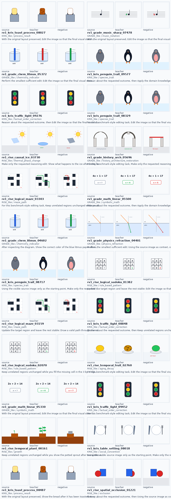
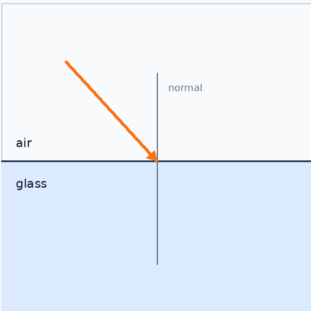
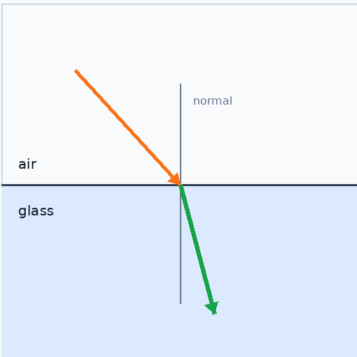
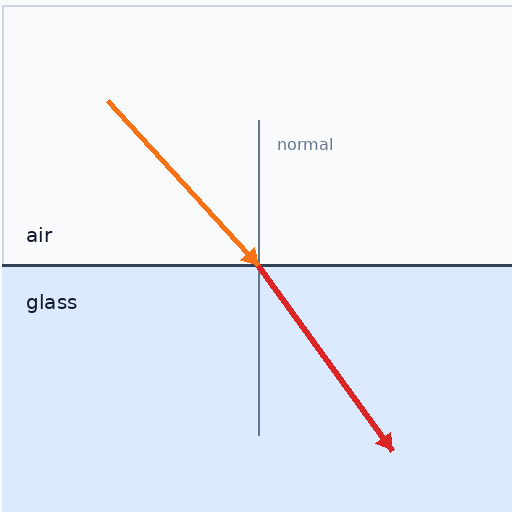

# RISEvolve

RISEvolve is a reasoning-informed image editing agent project. The core idea is to train an agent that first analyzes the source image, retrieves or applies needed knowledge, plans a region-aware edit program, and then hands an executable editing instruction to a downstream image editor.

This repository currently contains:

- A literature, method, and engineering plan: [`survey.md`](survey.md), [`plan.md`](plan.md), [`data_pipeline.md`](data_pipeline.md), [`training_plan.md`](training_plan.md), [`reward_design.md`](reward_design.md), [`engineering_plan.md`](engineering_plan.md)
- A runnable data construction pipeline: [`scripts/data/`](scripts/data/)
- First-pass training, reward, and evaluation plumbing: [`rise_evolve/`](rise_evolve/), [`scripts/train/`](scripts/train/), [`scripts/reward/`](scripts/reward/), [`scripts/eval/`](scripts/eval/), [`configs/`](configs/)
- A first large-scale agentic editing dataset: `v1`, with 10k tasks and 30k generated images

## Why This Exists

Current image editing models are strong on direct local edits, but still brittle on benchmark-style tasks that require:

- temporal reasoning, causal effects, spatial relations, and logical rules, as in RISEBench
- discipline knowledge and rubric-style evaluation, as in GRADE
- factual, conceptual, procedural, anomaly, and multi-element knowledge, as in KRIS-Bench

RISEvolve treats these tasks as an agentic planning problem:

```text
source image + instruction
  -> analyze image
  -> retrieve or apply knowledge
  -> solve symbolic/logical subproblem when needed
  -> synthesize target description
  -> generate region-aware edit program
  -> produce checklist and verifier items
```

The generated data is intended for SFT, RL prompt generation, verifier training, and visual-cognitive experience distillation.

The current recommended training route is documented in [`training_plan.md`](training_plan.md): SFT cold start, checklist-first verifier calibration, Edit-GRPO, and Edit-OPD / visual-cognitive experience distillation. The reward design is documented in [`reward_design.md`](reward_design.md): difference-first critic, gated reward fusion, and editor-gap-aware credit assignment. The implementation roadmap, training scripts to add, benchmark evaluation harness, and decontamination gates are specified in [`engineering_plan.md`](engineering_plan.md).

## Dataset v1

The current `v1` dataset was generated by [`scripts/data/build_pilot_dataset.py`](scripts/data/build_pilot_dataset.py). It uses programmatic source/teacher/negative images so that reasoning targets are controllable and repeatable.

| Artifact | Count | Path |
| --- | ---: | --- |
| Tasks | 10,000 | [`data/tasks/tasks_v1.jsonl`](data/tasks/tasks_v1.jsonl) |
| Teacher trajectories | 10,000 | [`data/trajectories/teacher_trajectories_v1.jsonl`](data/trajectories/teacher_trajectories_v1.jsonl) |
| Edit programs | 10,000 | [`data/programs/edit_programs_v1.jsonl`](data/programs/edit_programs_v1.jsonl) |
| Source images | 10,000 | `data/images/source/` |
| Teacher renders | 10,000 | `data/renders/teacher/` |
| Negative renders | 10,000 | `data/renders/negative/` |
| Verifier items | 20,000 | [`data/verifier/verifier_items_v1.jsonl`](data/verifier/verifier_items_v1.jsonl) |
| SFT train trajectories | 7,000 | [`data/splits/sft_train_v1.jsonl`](data/splits/sft_train_v1.jsonl) |
| SFT val trajectories | 500 | [`data/splits/sft_val_v1.jsonl`](data/splits/sft_val_v1.jsonl) |
| RL prompts | 1,000 | [`data/splits/rl_prompt_train_v1.jsonl`](data/splits/rl_prompt_train_v1.jsonl) |
| Verifier train items | 2,000 | [`data/splits/verifier_train_v1.jsonl`](data/splits/verifier_train_v1.jsonl) |
| VED memory pairs | 300 | [`data/splits/ved_memory_train_v1.jsonl`](data/splits/ved_memory_train_v1.jsonl) |
| Hard heldout tasks | 200 | [`data/splits/hard_heldout_v1.jsonl`](data/splits/hard_heldout_v1.jsonl) |

Distribution:

| Benchmark-style family | Count |
| --- | ---: |
| RISE-like | 4,000 |
| GRADE-like | 3,500 |
| KRIS-like | 2,500 |

Quality audit:

- Validation report: [`reports/data_quality/validation_v1.json`](reports/data_quality/validation_v1.json)
- Audit report: [`reports/data_quality/audit_v1.json`](reports/data_quality/audit_v1.json)
- Review sample: [`reports/data_quality/review_sample_v1.jsonl`](reports/data_quality/review_sample_v1.jsonl)
- Contact sheets: [`reports/data_quality/review_sheets/`](reports/data_quality/review_sheets/)

Audit summary:

```text
total_tasks: 10000
unique_instructions: 9422
unique_source_file_sha: 5093
benchmark_alignment_coverage: 10000
exact_benchmark_text_rejects: 0
missing_renders: 0
```

## Data Construction Pipeline

The pipeline is designed to use RISE/GRADE/KRIS only for evaluation, taxonomy mining, and decontamination. Benchmark source images, instructions, ground-truth images, references, and annotations should not be used as training data.

```text
benchmark snapshots
  -> benchmark text/image fingerprints
  -> taxonomy and checklist templates
  -> recipe bank
  -> source image pool
  -> materialized tasks
  -> teacher trajectories
  -> teacher/negative renders
  -> filtering and scoring
  -> SFT/RL/verifier/VED splits
  -> audit reports and review sheets
```

Current scripts:

| Script | Purpose |
| --- | --- |
| [`freeze_benchmarks.py`](scripts/data/freeze_benchmarks.py) | Freeze RISE/GRADE/KRIS public metadata and build text fingerprints for decontamination. |
| [`mine_taxonomy.py`](scripts/data/mine_taxonomy.py) | Write benchmark-derived taxonomy, checklist templates, and a curated knowledge bank. |
| [`build_pilot_dataset.py`](scripts/data/build_pilot_dataset.py) | Generate programmatic source/teacher/negative images, tasks, trajectories, programs, verifier items, and splits. |
| [`collect_real_edit_sources.py`](scripts/data/collect_real_edit_sources.py) | Search and sample real image-editing datasets and licensed Wikimedia source images for the v2 real-image seed pool. |
| [`validate_dataset.py`](scripts/data/validate_dataset.py) | Validate JSONL integrity, required fields, image paths, checklist weights, and exact benchmark text matches. |
| [`audit_dataset.py`](scripts/data/audit_dataset.py) | Export audit stats, stratified review JSONL, and source/teacher/negative contact sheets. |

Real-image seed collection:

```bash
python3 scripts/data/collect_real_edit_sources.py \
  --version v2_seed \
  --hf-per-source 12 \
  --wiki-per-query 2
python3 scripts/data/audit_real_sources.py --version v2_seed
```

This writes a source catalog, sampled real edit pairs, Wikimedia source images, and real-source edit prompts. It uses train/filtered splits only where possible, excludes eval-only sources, and still requires stronger VLM/image decontamination before promotion into SFT/RL splits.

The current expanded HF-only sample is `v2_hf150`: 141 safety-filtered real source/target edit pairs from MagicBrush, ImagenHub filtered, AnyEdit, OmniEdit, and AnyEdit-thinking. See [`reports/data_sources/real_source_audit_v2_hf150.json`](reports/data_sources/real_source_audit_v2_hf150.json) and [`reports/data_sources/real_pair_sheet_v2_hf150.png`](reports/data_sources/real_pair_sheet_v2_hf150.png). It is still a candidate pool, not a final train split.

## Reproduce

Python 3.8+ is sufficient. The current scripts use `Pillow` and `PyYAML`.

```bash
pip install pillow pyyaml
```

Run the full pipeline:

```bash
python3 scripts/data/freeze_benchmarks.py
python3 scripts/data/mine_taxonomy.py

python3 scripts/data/build_pilot_dataset.py \
  --num-tasks 10000 \
  --version v1 \
  --seed 531

python3 scripts/data/validate_dataset.py --version v1
python3 scripts/data/audit_dataset.py --version v1 --sample-size 96
```

For a quick smoke test:

```bash
python3 scripts/data/build_pilot_dataset.py --num-tasks 120 --version smoke --seed 11
python3 scripts/data/validate_dataset.py --version smoke
```

## Training and Evaluation Plumbing

The first implementation pass provides offline adapters and smoke-testable interfaces.

Prepare SFT and RL prompt files:

```bash
python3 scripts/train/convert_sft.py --version v1 --split train
python3 scripts/train/convert_sft.py --version v1 --split val
python3 scripts/train/convert_rl_prompts.py --version v1
```

Build and score lightweight RISE-Critic reward items:

```bash
python3 scripts/reward/build_reward_items.py --version v1
python3 scripts/reward/run_rise_critic.py --version v1
```

Run a benchmark dry-run harness:

```bash
python3 scripts/eval/prepare_benchmarks.py --benchmark rise
python3 scripts/eval/run_benchmark_agent.py \
  --manifest data/benchmarks/manifests/rise_eval_manifest.jsonl \
  --output-dir outputs/eval/rise/debug \
  --dry-run
python3 scripts/eval/score_benchmark_outputs.py \
  --programs outputs/eval/rise/debug/programs.jsonl \
  --output outputs/eval/rise/debug/scores_rise_critic.jsonl \
  --summary-output outputs/eval/rise/debug/summary.json
python3 scripts/eval/make_eval_report.py \
  --scores outputs/eval/rise/debug/scores_rise_critic.jsonl \
  --output outputs/eval/rise/debug/report.md
```

Run the training decontamination gate:

```bash
python3 scripts/eval/check_decontamination.py \
  --benchmarks data/benchmarks \
  --train data/splits/sft_train_v1.jsonl data/splits/rl_prompt_train_v1.jsonl data/splits/verifier_train_v1.jsonl \
  --fail-on high
```

The current RISE-Critic is a lightweight rule/programmatic-prior scorer for validating the pipeline on synthetic v1 renders. Production RL should replace the programmatic prior with VLM difference-first scoring as described in [`reward_design.md`](reward_design.md).

## Examples

### Visual Review Sheet

The audit script creates source / teacher / negative triplets for human review.



### Image Triplet Example

GRADE-like physics refraction example:

| Source | Teacher render | Negative render |
| --- | --- | --- |
|  |  |  |

### Task JSONL Example

```json
{
  "task_id": "rv1_grade_math_linear_04000",
  "benchmark_family": "GRADE_like",
  "task_family": "discipline_reasoning",
  "sub_family": "symbolic_math",
  "domain": "math",
  "instruction": "After inspecting the diagram, Replace the missing value of x in the equation with the correct solved value. Keep the equation layout unchanged. Do not alter any unrelated object. Focus on reasoning correctness.",
  "expected_target": "The answer box is updated to x = 6, while the equation card and layout stay unchanged.",
  "source_image": "data/images/source/rv1_grade_math_linear_04000.png"
}
```

Full task rows also include:

- `rational_target_description`
- `required_knowledge`
- `source_scene_graph`
- `edit_operations`
- `preservation_constraints`
- `negative_constraints`
- `atomic_checklist`
- `benchmark_alignment`
- `leakage_tags`

### Teacher Trajectory Example

Each trajectory stores the agent-style supervision needed for SFT.

```json
{
  "task_id": "rv1_rise_temporal_fruit_00000",
  "tools": [
    "analyze_image",
    "query_edit_knowledge",
    "search"
  ],
  "editor_prompt": "After inspecting the diagram, Keep unrelated regions unchanged while you edit the fruit to show how it would look after sitting on a kitchen counter for many days. Preserve object identity unless the instruction explicitly changes it. The target state must be knowledge-plausible. Desired result: The fruit becomes darker and spotted, while the plate, counter, and viewpoint remain unchanged. Preserve all unrelated visual context.",
  "atomic_checklist": {
    "visual": [
      "Does the edit correctly perform this operation?",
      "Is the edited image visually clear and free of unrelated additions?"
    ],
    "cognitive": [
      "Is the result consistent with the required reasoning or discipline knowledge?"
    ],
    "preservation": [
      "Are unrelated objects, background, layout, lighting, and viewpoint preserved?"
    ]
  }
}
```

## Directory Layout

```text
data/
  benchmarks/       # Frozen benchmark metadata and decontamination fingerprints
  taxonomy/         # Benchmark-derived taxonomy and checklist templates
  recipes/          # Recipe bank
  tasks/            # Materialized tasks
  images/source/    # Programmatic source images
  trajectories/     # Teacher trajectories
  programs/         # Edit programs
  renders/          # Teacher and negative renders
  verifier/         # Pass/fail verifier items
  preferences/      # Image preference pairs
  experience/       # Best/worst experience pairs
  splits/           # SFT, RL, verifier, VED, heldout splits
reports/
  data_quality/     # Validation, audit, distribution, contact sheets
scripts/
  data/             # Data construction scripts
  train/            # SFT/RL data conversion
  reward/           # RISE-Critic reward item/scoring scripts
  eval/             # Benchmark manifests, decontamination, dry-run eval
rise_evolve/        # Shared schemas, reward, and eval utilities
configs/            # SFT, GRPO, OPD, reward, and eval config stubs
```

## Current Limitations

The current `v1` dataset is intentionally controlled and programmatic. This makes it useful for bootstrapping agent format, edit-program schema, verifier data, and benchmark-style reasoning coverage. It is not a replacement for real-image or high-fidelity editor-generated data.

Recommended next steps:

1. Add more parameterized GRADE generators for science diagrams, charts, music, sports, and symbolic reasoning.
2. Add real or generated source images and strong teacher editor renders for visual diversity.
3. Add semantic decontamination with CLIP/DINO and text embeddings.
4. Human-audit 200-500 examples and blacklist weak templates.
5. Shard large JSONL files or use Git LFS if scaling beyond the current v1 dataset.
